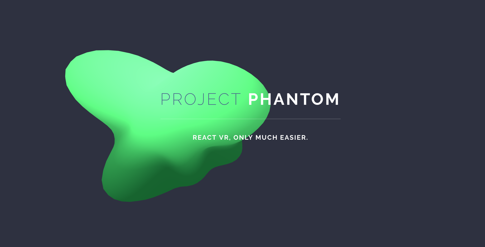

# PhantomVR

## Table of Contents
- [Introduction](#introduction)
- [Summary of features](#features)
- [Technologies](#technologies)
- [Additional Features](#additional-features)

## Introduction

**PhantomVR** is a proof-of-concept project that allows developers to create web applications using ReactVR a framework for building VR projects using the declarative power of React.

Currently, there is a gap in the VR world between VR content and already existing web applications. The potential that VR gives us is endless, with people already taking advantage to create incredibly immersive experiences in the form of games, spatial visualizations, and artistic projects. However, websites remain static, clunky, and uninteractive. Our goal is to bridge this gap and bring the modern web application into this new platform.

React VR, built off of various technologies including React Native, three.js, WebGL, and WebVR, has the capacity to render single-page applications using the website (and, more specifically, React) design principles, but there is very little that comes with React VR for making this easy. At this point, there are only a few special components that come bundled with React VR (that are built off React Native, React, etc.):

* `Pano`
* `View`
* `Text`
* `Animation`
* `VrButton`
* etc.

As with HTML Elements and React Components, there is certainly the potential to customize websites to a developer's liking. However, for those who lack a thorough understanding of the considerations necessary in rendering components in a 3D dynamic space and principles of VR design, but who simply want to get their website onto a page, our components will take out that guesswork for them.

**Simple explanation**: People have websites/web apps and want to display them in 360° space using VR. We are making that easier by leveraging and building off of existing technologies that have yet to be explored for websites.

This project is being managed by [Drew Stukey](https://github.com/stukey524), [Jon Halloran](https://github.com/JonHalloran), [Michael Vasquez-Pompili](https://github.com/Mpompili), and [Nick Welch](https://github.com/nwelchr).

## Summary of features

### 1.) Node.js Module (NPM)

[Package and Readme](https://www.npmjs.com/package/phantom_components) 
We have created a React VR library in the form of a Node.js module that allows people to create responsive, flexible, and modular sites. Our components provide a basic template for beginners to construct websites without worrying about the complications that React VR presents, such as 3d spacing and limitations on styling.

### 2.) NPM Package Runner

[Clonable repo](https://github.com/PhantomVRTranslate/Phantom-Components-Demo) 
[Demo Page](https://phantomvrtranslate.github.io/Phantom-Components-Demo/) 
In addition to a component library, we have provided a demo site and build in the form of an npx that people can use to create their own sites using our component hierarchy in the intended manner. This also removes issues on getting started that cannot be addressed by our components, e.g. a custom raycaster (i.e. cursor) and other minor configuration settings.

### 3.) HTML file processor and VR previewer

[Scripts](https://github.com/PhantomVRTranslate/PhantomScripts) 
[Demo page](https://phantomvrtranslate.github.io/Phantom-Demo-Site/) 
We also have a script tag that can be inserted into any static HTML page which, coupled with various semantic class names inserted into tags, will pull that information and render it in VR, giving the user a preview of what their site could look like in VR. This will give them an idea of how their website would work in a basic VR environment before diving in and creating their own site using our components.

## Technologies

* Software: React VR
* Hardware: Gear VR, desktop, mobile# PhantomScripts

## Additional Features (to be implemented)
- `Form` and `Input` components
- `CarouselPage` component (as a full-page image gallery)
- More than just content: VR sites that are responsive and interactive and have information that persists after a session.